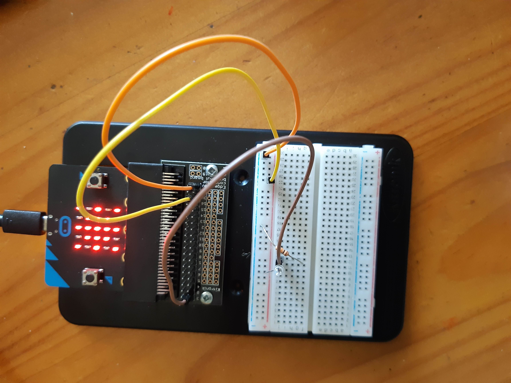
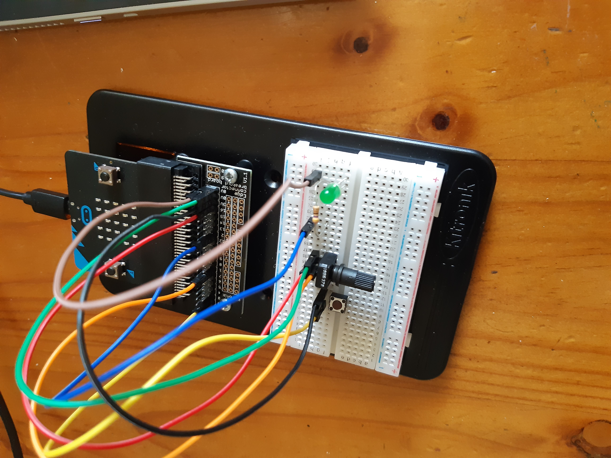
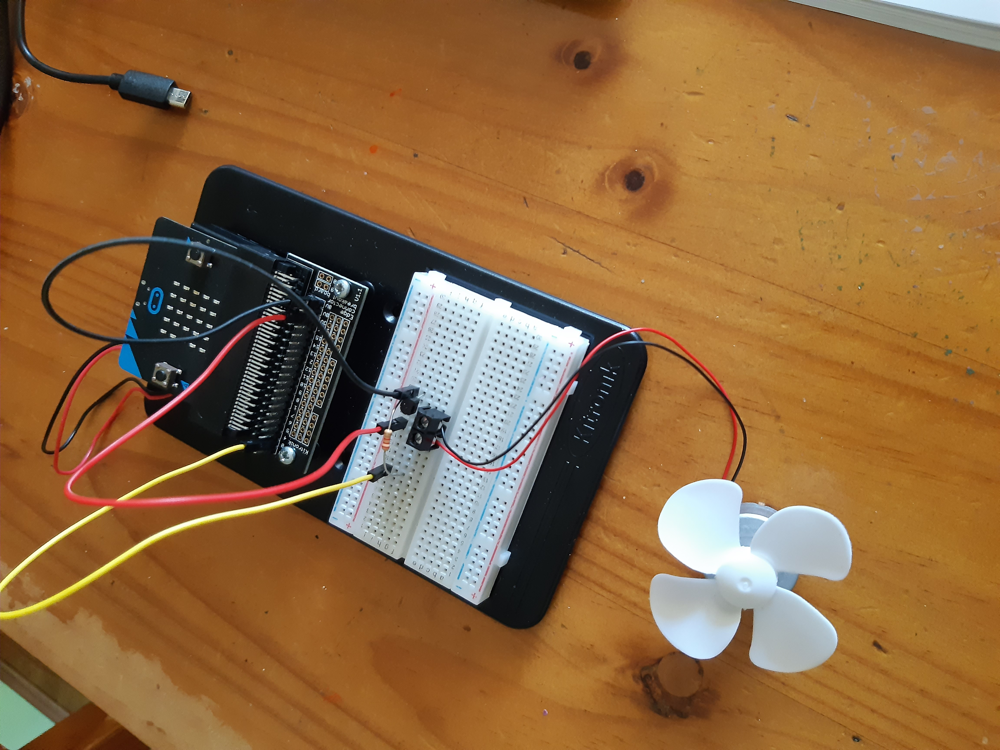
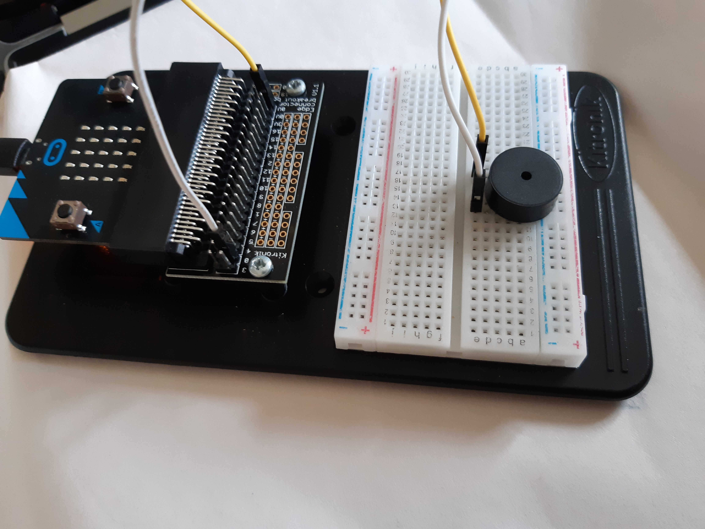

# Inventor Kit Experiments

*Markdown reference: https://guides.github.com/features/mastering-markdown/*

## Instructions ##

*For a selection of 5 inventor kit experiments that you choose, fill out the following sections.

### Experiment name ###

Using A Light Sensor And Analog Inputs

#### Photo of completed project ####
*In the code below, replace `missingimage.png` with the name of the image, which should be in the `kitexperiments` folder.*

(Image of Experiment 2 where the phototransistor is used to detect the light value and display an image on the microbit)

#### Reflection ####

In this experiment, something new to me was the use of the phototransistor to display the coresponding image of a sun (in light evvironments) and a moon (in dark environments). Something I learned while doing this experiment was that the light variable was set to 200 however this caused the LEDs to display the sun even if the phototransistor was fully covered, With trial and error I found the best number to be 500 that way covering the phototransistor made the moon show and leaving it un covered displayed the sun.

This experiment could be the basis of a real world application such as (using the phototransistor to turn on and off lights when it gets to night time without turning a switch on or off).

### Experiment name ###

Dimming An LED Using A Potentiometer

#### Photo of completed project ####
In the code below, replace imagemissing.jpg with the name of the image, which should be in the kitexperiments folder.

(This experiment used a potentiometer to change the brightness of an LED)

#### Reflection ####

In this experiment, something new to me was or something I learned was (adding an external switch and the potentiometer to adjust how bright the LED was ).

This experiment could be the basis of a real world application such as (insert something here).

### Experiment name ###

Using The Accelerometer To Control Motor Speed

#### Photo of completed project ####
In the code below, replace imagemissing.jpg with the name of the image, which should be in the kitexperiments folder.

(Experiment 5 used the accelerometer in the microbit to coltrol the speed of the fan.)

#### Reflection ####

In this experiment, something new to me was or something I learned was (was how the micro bit has the accelerometer included in it. It was good to learn how to use the elements included on the microbit to control something ).

This experiment could be the basis of a real world application such as (insert something here).

### Experiment name ###

Setting The Tone With A Piezo Buzzer

#### Photo of completed project ####
In the code below, replace imagemissing.jpg with the name of the image, which should be in the kitexperiments folder.

(Insert a caption here)

#### Reflection ####

In this experiment, something new to me was or something I learned was (insert something here).

This experiment could be the basis of a real world application such as (insert something here).

### Experiment name ###

Making A Game Using The Compass

#### Photo of completed project ####
In the code below, replace imagemissing.jpg with the name of the image, which should be in the kitexperiments folder.

(Insert a caption here)

#### Reflection ####

In this experiment, something new to me was or something I learned was (insert something here).

This experiment could be the basis of a real world application such as (insert something here).

