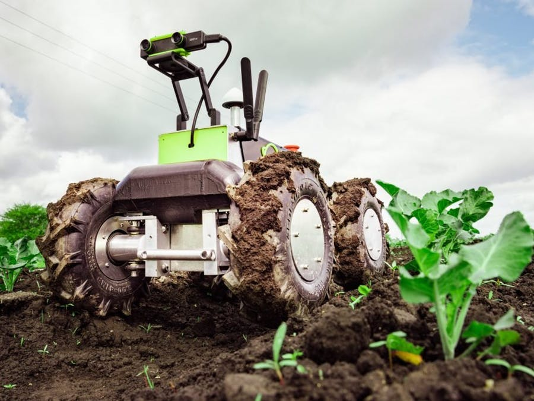
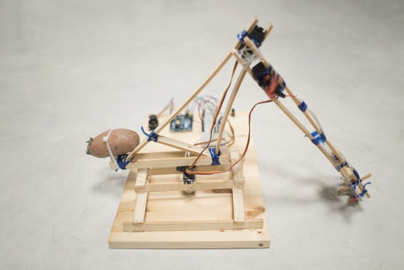
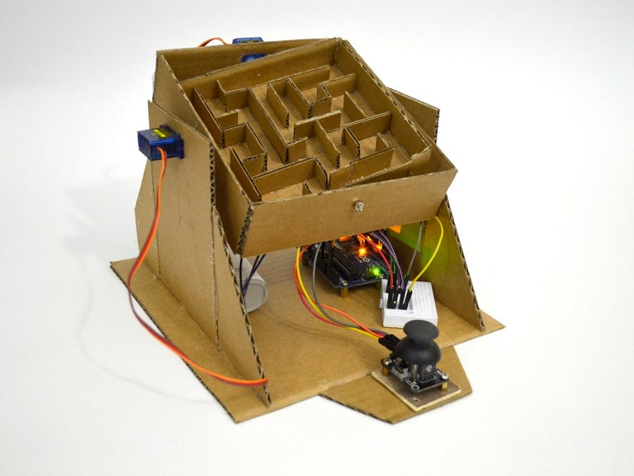
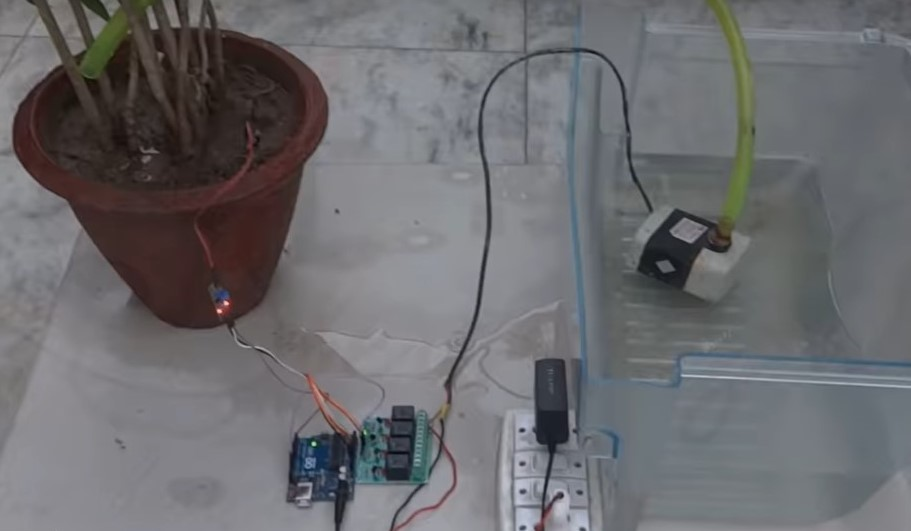
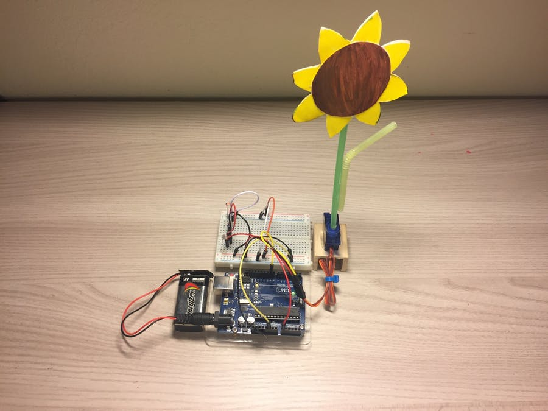
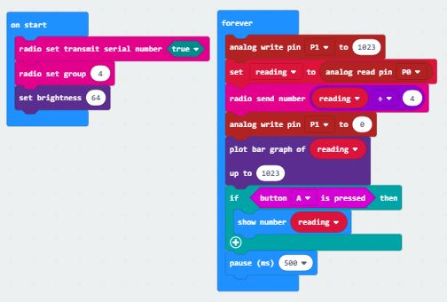
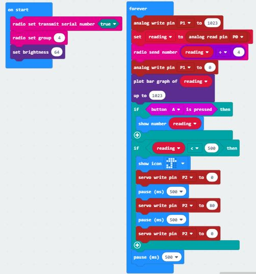

# Assessment 1: Replication project

*Fill out the following workbook with information relevant to your project.*

*Markdown reference:* [https://guides.github.com/features/mastering-markdown/](http://guides.github.com/features/mastering-markdown/)

## Replication project choice ##
Plant Watering

## Related projects ##
*Find about 6 related projects to the project you choose. A project might be related through  function, technology, materials, fabrication, concept, or code. Don't forget to place an image of the related project in the* `replicationproject` *folder and insert the filename in the appropriate places below. Copy the markdown block of code below for each project you are showing, updating the number* `1` *in the subtitle for each.*

### Related project 1 ###
Earth Analyzer

https://create.arduino.cc/projecthub/gowthamkishoreindukuri/earth-analyzer-262acb?ref=search&ref_id=earth%20analyzer&offset=0

This project is related to the plant watering project because it is also used to test the soil condition exept on a larger and more involved and detailed scale. By being able to test a larger area with the technology set on wheels for use on large farm land and then send different alerts directly to your phone about the moisture level and soil condition.

### Related project 2 ###
Robotic Arm from Recycled Materials

https://create.arduino.cc/projecthub/circuito-io-team/robotic-arm-from-recycled-materials-7e318a?ref=search&ref_id=robotic%20arm%20from%20recycled%20materials&offset=0

This project is related to mine because it uses a servo motor to make the robotic move. In the video displayed on the website it is shown making a cup of tea however with more refined controls and movements it could be used for a variety of things?????????????/.

### Related project 3 ###
Arduino Marble Maze Labyrinth

https://create.arduino.cc/projecthub/AhmedAzouz/arduino-marble-maze-labyrinth-bd9ea6

This project is related to mine because it uses servo motors to manipulate direction of the maze to different angles, it is controlled by a modulo joystick to move the ball aroung the maze.  

### Related project 4 ###
Automatic Watering System for plants using Arduino

https://www.youtube.com/watch?v=nUHizmtyt74

This project is related to mine because it is very similar in terms of the automating plant watering project except it uses a pump rather than the servo motor to water the plant. This might need more power however it would be more efficient for watering lager plants rather than the small amount from the straw.

### Related project 5 ###
Arduino Sunflower

https://create.arduino.cc/projecthub/Rick_Findus/arduino-sunflower-c4fd84

This project is related to mine because it uses the servo motor along with two photoresistors to turn the sunflower towards the light. This is a fairly simple project but displays the use of the servo motors in a easy to understand way.

## Reading reflections ##
*Reflective reading is an important part of actually making your reading worthwhile. Don't just read the words to understand what they say: read to see how the ideas in the text fit with and potentially change your existing knowledge and maybe even conceptual frameworks. We assume you can basically figure out what the readings mean, but the more important process is to understand how that changes what you think, particularly in the context of your project.*

*For each of the assigned readings, answer the questions below.*

### Reading: Don Norman, The Design of Everyday Things, Chapter 1 (The Psychopathology of Everyday Things) ###

*What I thought before: Describe something that you thought or believed before you read the source that was challenged by the reading.*

Before reading the chapter in the design of everyday things I had never really given much thought to the design of how things work. If I had an appliance that I didnt know how to use I would try pressing random buttons or just read the instruction manual. The reading challenged this thought by proving that concepts like Affordances, signifiers, mapping, feed back and conceptual models all play a roll in makng these interactions run smoothly.

*What I learned: Describe what you now know or believe as a result of the reading. Don't just describe the reading: write about what changed in YOUR knowledge.*

I learnt how much carfull consideration needs to go into the development of everyday things to make it as comfortable to use and as user friendly as possible because if something is unclear in how its used people will very easily get frustrated and buy a different option.

*What I would like to know more about: Describe or write a question about something that you would be interested in knowing more about.*

I would like to know if there are any groups that specialize in giving or gaining feedback and direction towards the best design of somthing or if it is just up to the creators own trial and error to discover any faults that an invention might have.

*How this relates to the project I am working on: Describe the connection between the ideas in the reading and one of your current projects or how ideas in the reading could be used to improve your project.*

The concepts mentioned in this chapter relates to the project I am doing with the consideration of clear signifiers. With the plant watering system there is the option to get an accurate number reading of the moisture content by pressing the A button, however there is no signifier directing someone to do so; without any direct instructon no one would know it was an option.

### Reading: Chapter 1 of Dan Saffer, Microinteractions: Designing with Details, Chapter 1 ###

*What I thought before: Describe something that you thought or believed before you read the source that was challenged by the reading.*

Before reading this chapter about microinteractions I had no idea that these small components of technology make up such a large portion of everyday life. Having a app for playing music seems like such an effortless thing however it would be very troublesome if the volume could not be changed.  This alone isnt that significant however like the example in the chapter with the alarm going off there are some occations where these micro interactions are vital to be correct and easy to use and understand.

*What I learned: Describe what you now know or believe as a result of the reading. Don't just describe the reading: write about what changed in YOUR knowledge.*

I learned from this chapter how important these small effortless additions to technology are and how much of a difference they make in the overall usefulness of the object and how many micro interactions can be included in one piece of technology. 

*What I would like to know more about: Describe or write a question about something that you would be interested in knowing more about.*

It would be interesting to know how to decide what kinds if micro interactions would be necessary for making a new piece of technology and what options are available to a designer.

*How this relates to the project I am working on: Describe the connection between the ideas in the reading and one of your current projects or how ideas in the reading could be used to improve your project.*

There is not a lot of ineraction in the automatic plant watering project so it would be interesting to know how these could improve it as a whole.  I think that if this was scaled up to a more interactive and professional style device, the posibility of including more microinteraction in the project would be great.

### Reading: Scott Sullivan, Prototyping Interactive Objects ###

*What I thought before: Describe something that you thought or believed before you read the source that was challenged by the reading.*

Before reading this I thought that coding and creating useful pieces of technology would be difficult and confusing however in this reading the author clearly sates that he had no prior knowledge of coding, However half way throught the chapter, when the project was only really in a testing phase, the shop owners had already discovered problems in the layout of their shop.  The author learnt the basics through Arduino projects, which were similar to what he was looking to do, and then adapted the code through further research and trial and error.  

*What I learned: Describe what you now know or believe as a result of the reading. Don't just describe the reading: write about what changed in YOUR knowledge.*

The author clearly demonstrated that the process of making something usefull doesnt have to be difficult, especialy with reasorces like the internet where if a problem arises a simple search can explain whats going wrong or what could be more effective.  I learnt that i can create a project using these kinds of components without the need to study coding or electronics.

*What I would like to know more about: Describe or write a question about something that you would be interested in knowing more about.*

It would be good to know in more detail how this technology could be used to help shops improve or if it could be used more efficiently in other places and situations.

*How this relates to the project I am working on: Describe the connection between the ideas in the reading and one of your current projects or how ideas in the reading could be used to improve your project.*

This reading relates to my project because while this is a replication project, it demonstrates the same trial and error and problem solving which is needed to overcome any problems, should they arise, and gives me the confidence to look online for solutions. Furthermore it proves that you need no previous experience to be able to use this kind of technology.

## Interaction flowchart ##
*Draw a flowchart of the interaction process in your project. Make sure you think about all the stages of interaction step-by-step. Also make sure that you consider actions a user might take that aren't what you intend in an ideal use case. Insert an image of it below. It might just be a photo of a hand-drawn sketch, not a carefully drawn digital diagram. It just needs to be legible.*

## Process documentation

*In this section, include text and images that represent the development of your project including sources you've found (URLs and written references), choices you've made, sketches you've done, iterations completed, materials you've investigated, and code samples. Use the markdown reference for help in formatting the material.*

*This should have quite a lot of information!*

*There will likely by a dozen or so images of the project under construction. The images should help explain why you've made the choices you've made as well as what you have done. Use the code below to include images, and copy it for each image, updating the information for each.*

This is the basic code for the moisture sensor, it takes a reading of the electric current from moisture in the environment around it then gives a visual reading on the LED display. A low moisture reading will show he bottom five LEDs lit up and a high reading will show all the LEDs lit up, furthermore adding the coding to give a number reading of the measurement on the A button will give a more accurate reading.

https://www.youtube.com/embed/TMm6dON7O5Y
This link shows the test reading for the moisture level with the nails on the ground.
The base reading given is :317 showing a relatively low moisture level.

In the case of this project the electronics will be hooked up to a plant to water it when the moisture level gets below a certain level. The code above adds the function of watering the plant with the assistance of a servo motor. This process takes the reading from the moisture level and if it is below the set level of 500 it will display an image of an umbrella to tell the micro bit that it needs to be watered then cause the servo motor to operate. The servo motor is a small motor designed to be programed to a set angle.  It is attached over a water source (a glass) by attaching it to a stick with rubberbands. The water is moved with the aid of a flexible straw that has been cut to allow the water to easily enter the tube when it is turned up before being tipped into the plant.

https://youtu.be/UT2JdFeszeg
The link above shows how the straw was satching on the rim of the glass.

After uploading the code to the micro bit I found I had to adjust the starting angle of the arm of the servo motor holding the straw so that it scoops the water up and tips it into the plant. My initial tests were using the motor and straw on a round glass however the shape of the glass gave limited space and caused the straw to get stuck on the rim.

https://www.youtube.com/watch?v=zgkEI8n5Qdc
The video above show the straw not getting caught on the rim.
I decided to switch the glass to a square one to allow the adequate room for the straw to operate efficiently.

https://youtu.be/8R_cq-f_MK8
This demonstrates the project working however I found that it is unnecessarily slow, I decided to change this and now it still works efficiently however it is much faster and will spent much less time watering the plant.

https://youtu.be/OqX12lhKVgA
This video demonstrates the project sucessfuly watering the plant and stopping when the moisture level is high enough.
https://youtu.be/9FmYNfNY0zo
The link shows the final reading of the plant watering project after it reached the level chosen to tell it to stop watering the plant. 

*Include screenshots of the code you have used.*

## Project outcome ##

*Complete the following information.*

### Plant Watering ###

### Project description ###

*In a few sentences, describe what the project is and does, who it is for, and a typical use case.* This project is to create an easy and efficient way for people to water the plants. This automatic plant watering system would prove useful for people with a buisy schedule who maybe  

### Showcase image ###

*Try to capture the image as if it were in a portfolio, sales material, or project proposal. The project isn't likely to be something that finished, but practice making images that capture the project in that style.*

### Additional view ###

*Provide some other image that gives a viewer a different perspective on the project such as more about how it functions, the project in use, or something else.*

### Reflection ###

*Describe the parts of your project you felt were most successful and the parts that could have done with improvement, whether in terms of outcome, process, or understanding.*

*What techniques, approaches, skills, or information did you find useful from other sources (such as the related projects you identified earlier)?*

*What ideas have you read, heard, or seen that informed your thinking on this project? (Provide references.)*

*What might be an interesting extension of this project? In what other contexts might this project be used?*
