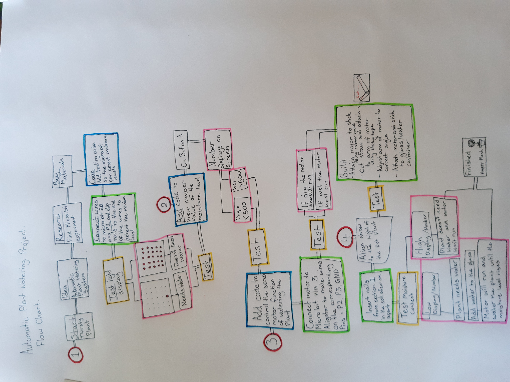
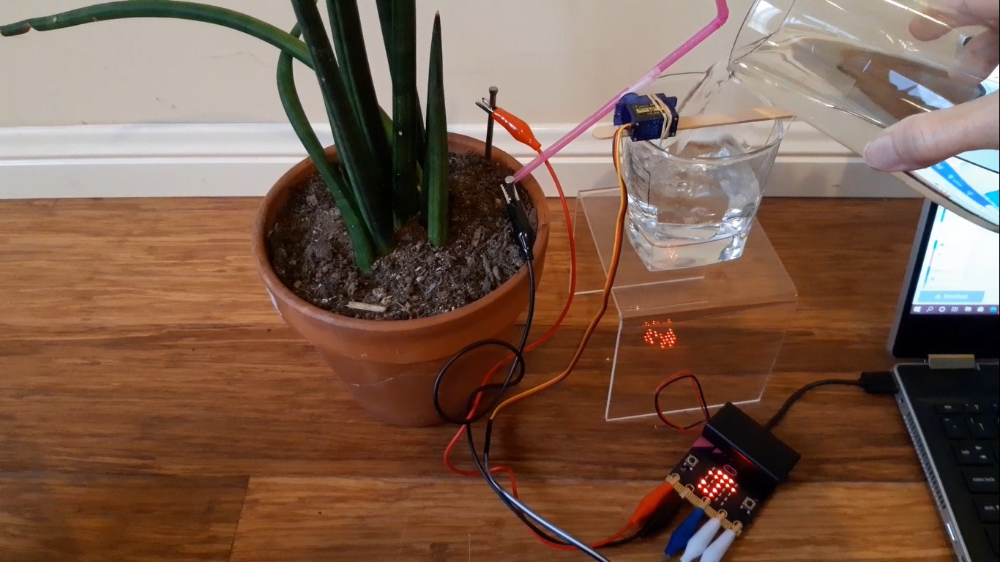

# Assessment 1: Replication project

## Replication project choice ##
Plant Watering

## Related projects ##

### Related project 1 ###
Earth Analyzer

https://create.arduino.cc/projecthub/gowthamkishoreindukuri/earth-analyzer-262acb?ref=search&ref_id=earth%20analyzer&offset=0

This project is related to the plant watering project because it is also used to test the soil condition exept on a larger and more involved and detailed scale. By being able to test a larger area with the technology set on wheels for use on large farm land and then send different alerts directly to your phone about the moisture level and soil condition, gives the ability to monitor the land without walking the entire distance.

### Related project 2 ###
Robotic Arm from Recycled Materials

https://create.arduino.cc/projecthub/circuito-io-team/robotic-arm-from-recycled-materials-7e318a?ref=search&ref_id=robotic%20arm%20from%20recycled%20materials&offset=0

This project is related to mine because it uses a servo motor to make the robotic arm move. In the video displayed on the website it is shown making a cup of tea however with more refined controls and movements it could be used for a variety of things. Such as a toy for children as a small crane or at an industrial level it could move things around in a work place.

### Related project 3 ###
Arduino Marble Maze Labyrinth

https://create.arduino.cc/projecthub/AhmedAzouz/arduino-marble-maze-labyrinth-bd9ea6

This project is related to mine because it uses servo motors to manipulate direction of the maze to different angles, it is controlled by a modulo joystick to tilt the maze to make the ball travel around the maze.  

### Related project 4 ###
Automatic Watering System for plants using Arduino

https://www.youtube.com/watch?v=nUHizmtyt74

This project is related to mine because it is very similar in terms of the automating plant watering project except it uses a pump rather than the servo motor to water the plant. This might need more power however it would be more efficient for watering larger plants rather than the small amount delivered from a straw.

### Related project 5 ###
Arduino Sunflower

https://create.arduino.cc/projecthub/Rick_Findus/arduino-sunflower-c4fd84

This project is related to mine because it uses the servo motor along with two photoresistors to turn the sunflower towards the light. This is a fairly simple project but displays the use of the servo motors in a easy to understand way.

## Reading reflections ##

### Reading: Don Norman, The Design of Everyday Things, Chapter 1 (The Psychopathology of Everyday Things) ###

Before reading the chapter in "The Design of Everyday Things" I had never really given much thought to the design of how things work. If I had an appliance that I didnt know how to use I would try pressing random buttons or just read the instruction manual. The reading challenged this thought by proving that concepts like affordances, signifiers, mapping, feed back and conceptual models all play a vital roll in makng these interactions run smoothly.

Furthermore, I learnt how much carefull consideration needs to go into the development of everyday things to make them as comfortable to use and as user friendly as possible. In contrast if something is unclear in how its used people will very easily get frustrated with it and buy a different option.

I would like to know if there are any groups that specialize in giving or gaining feedback and direction towards the best design of something or if it is just up to the creators own trial and error to discover any faults that an invention might have.

The concepts mentioned in this chapter relates to the project I am doing with the consideration of clear signifiers. With the plant watering system there is the option to get an accurate number reading of the moisture content by pressing the A button, however there is no signifier directing someone to do so, therefore without any direct instructon no one would know it was an option.

### Reading: Chapter 1 of Dan Saffer, Microinteractions: Designing with Details, Chapter 1 ###

Before reading this chapter about microinteractions I had no idea that these small components of technology make up such a large portion of everyday life. Having an app for playing music seems like such an effortless thing however it would be very troublesome if the volume could not be changed.  This alone isn't that significant however, like the example in the chapter with the alarm going off, there are some occasions where these microinteractions are vital to be correct and easy to use and understand.

I learned from this chapter how important these small effortless additions to technology are and how much of a difference they make in the overall usefulness of the object and how many microinteractions can be included in one piece of technology. 

It would be interesting to know how to decide what kinds if microinteractions would be necessary for making a new piece of technology and what options are available to a designer.

There is not a lot of ineraction in the automatic plant watering project so it would be interesting to know how these could improve it as a whole.  I think that if this was scaled up to a more interactive and professional style device, the posibility of including more microinteractions in the project would be great such as keeping a record of daily/weekly measurements and water consumption.

### Reading: Scott Sullivan, Prototyping Interactive Objects ###

Before reading this I thought that coding and creating useful pieces of technology would be difficult and confusing however in this reading the author clearly sates that he had no prior knowledge of coding.  Despite this,  half way throught the chapter, when the project was only really in a testing phase, the shop owners had already discovered problems in the layout of their shop.  The author learnt the basics of coding through copying and modifying Arduino projects, which were similar to what he was looking to do.  He then adapted the code through further research and trial and error.  

The author clearly demonstrated that the process of making something usefull doesn't have to be difficult, especialy with reasorces like the internet where if a problem arises a simple search can explain whats going wrong or what could be more effective.  I learnt that a project can be created using these kinds of components without the need to study coding or electronics.

It would be good to know in more detail how this technology could be used to help shops improve or if it could be used more efficiently in other places and situations.

This reading relates to my project because while this is a replication project, it demonstrates the same trial and error and problem solving which is needed to overcome any problems, should they arise, and gives me the confidence to look online for solutions. Furthermore it proves that you need no previous experience to be able to use this kind of technology.

## Interaction flowchart ##

## Process documentation

This is the basic code for the moisture sensor, it takes a reading of the electric current from moisture in the environment around it then gives a visual reading on the LED display. A low moisture reading will show he bottom five LEDs lit up and a high reading will show all the LEDs lit up, furthermore adding the coding to give a number reading of the measurement on the A button will give a more accurate reading.

https://www.youtube.com/embed/TMm6dON7O5Y

This link shows the test reading for the moisture level with the nails on the ground.
The base reading given is :317 showing a relatively low moisture level.

In the case of this project the electronics will be hooked up to a plant to water it when the moisture level gets below a certain level. The code above adds the function of watering the plant with the assistance of a servo motor. This process takes the reading from the moisture level and if it is below the set level of 500 it will display an image of an umbrella to tell the micro bit that it needs to be watered then cause the servo motor to operate. The servo motor is a small motor designed to be programed to a set angle.  It is attached over a water source (a glass) by attaching it to a stick with rubberbands. The water is moved with the aid of a flexible straw that has been cut to allow the water to easily enter the tube when it is turned up before being tipped into the plant.

https://youtu.be/UT2JdFeszeg

The link above shows how the straw was catching on the rim of the glass.

After uploading the code to the micro bit I found I had to adjust the starting angle of the arm of the servo motor holding the straw so that it scoops the water up and tips it into the plant. My initial tests were using the motor and straw on a round glass however the shape of the glass gave limited space and caused the straw to get stuck on the rim.

https://www.youtube.com/watch?v=zgkEI8n5Qdc

The video above show the straw not getting caught on the rim.
I decided to switch the glass to a square one to allow the adequate room for the straw to operate efficiently.

https://youtu.be/8R_cq-f_MK8

This demonstrates the project working however I found that it is unnecessarily slow, I decided to change this and now it still works efficiently however it is much faster and will spent significantly less time watering the plant.

https://youtu.be/OqX12lhKVgA

This video demonstrates the project sucessfuly watering the plant and stopping when the moisture level is high enough.

https://youtu.be/9FmYNfNY0zo

The link shows the final reading of the plant watering project after it reached the level chosen to tell it to stop watering the plant. 

## Project outcome ##

### Plant Watering ###

### Project description ###

This project is designed to create an easy and efficient way for people to know when to water their plants by monitoring moisture levels in the soil. This automatic plant watering system would prove useful for people with a busy schedule who may forget or for people with disibilites who maybe don't have the physical capability to water a plant.

### Showcase image ###

### Additional view ###

### Reflection ###

I found the coding and building of the project simple and straight forward, and was happy with the overall result. I did however have problems with the power suply to the servo motor where if it wasn't plugged into both the battery pack and my laptop it would fail to run any angles above 60 degrees.  Another problem was how little water the device gave the plant each time it tipped. It would be much more efficient if instead of a straw we used a larger funnel type scoop.

I found that the Earth Analyzer and the Automatic Watering System were using specific moisture detecting device in place of the nails. I considered using one of these as well but found as the nails worked fine I didnt want to buy something that overall was unnecessary. These projects also make it clear that this application would work as it is intended to.

I started out reading the microbit website (https://microbit.org/get-started/user-guide/overview/) to help me understand the possibilities and limitations of this device. It gave me a good overall understanding of how this technology is used and helped to reinforce some of the notes or ideas mentioned in class.

The page on Science Buddies about Green Technology (https://www.sciencebuddies.org/science-fair-projects/project-ideas/Elec_p066/electricity-electronics/build-an-electronic-soil-moisture-sensor-to-conserve-water) talks about how this kind of devise can be of benefit on a broader scale than one pot plant. It brings light to how we must conserve water and gives the example of a farmer watering a field of crops after it has just rained. This was a higher powered project that did not use a microbit however was a similar setup to the moisture detection part of the project furthermore this device does not water plants only test the soils moisture leves.

Next I found a page on Science Scope (https://sciencescope.uk/product/microbit-plant-watering-system/) which used a microbit in a plant watering system however this used a small water pump which in contrast to my plant watering project had the ability to deliver more water in a faster method rather than in multiple small amounts. It also used similar coding to the project I am replicating.

Finaly on the microbit website I found the video in which the building process of my project was demonstrated (https://makecode.microbit.org/projects/plant-watering/make). This showed the setup of the project which was useful but I found that running the rubber band under the bottom of the glass was more secure than taping it to the side.

An interesting extention of this project would be if it could be linked to a program that monitors and records the water requirments of plants. This could aid in the care and maintenance of garden beds and pot plants in a water efficient way. Furthermore if it could be scaled up to monitor a whole garden or field it could provide prevent over/underwatering thereby saving water promoting healthier growth. With the Earth Analyzer and the Robitic arm I considered a possible alteration of this project being on wheels and have the testing nails on a robotic arm, it could potentially drive backwards and forwards and water a line of pot plants rather than just one.  Another alteration with only the robotic arm and a way to rotate the project (another motor) required could be to set the electronics in the middle of some pland that it would then turn and water a number of them rather than one, having this set up would also hide the project from view. 

